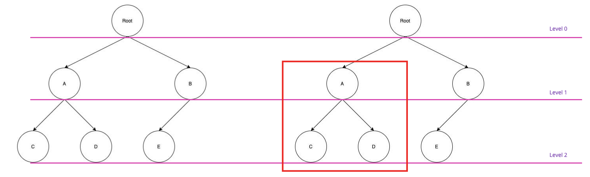
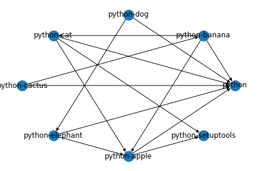
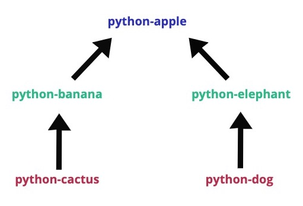
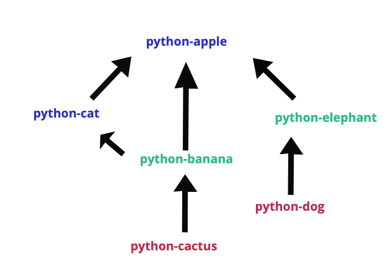

# Graph_Traversal


This repo contains the folders with PKGBUILDs.


The python tool interates through the folders and reads the PKGBUILD files. It extracts the dependecies from them.

Meanwhile, it generates dataframe named main_frame which is an adjacency matrix cotaining 1 and 0 as cell values.


**main_frame**

Index = list of packages in the system

Columns = list of packages in the system

Cell value: 1 represents relation between two packages, 0 means no direct-relation between two packages.


**Topological sorting**

A python framework ***toposort*** is used to sort the graph in topological order.

It also helps to check the cyclic dependecies.


## Functions

1. **get_depends(<PACKAGE_NAME>)**: returns list of dependencies for the given package

2. **custom_list(<PACKAGE_NAME>)**: returns dictionary where key is "level" and value is dependencies for that level.

for more understanding see below image 



The given tree/graph starts from the root node. If package A is passed as an argument the function will return the dictionary with levels and name of the nodes accordingly.

Level of the dictionary is numbered according to the subgraph as shown on the right side. For subgraph highlighted with red quare will be having level0 as A and level1 as [C,D].


# ggraph

ggraph is linux command line tool made using this notebook.

ggraph returns the sorted list of the packages. ggraph iterates through all the subdirectory in the current directory and reads PKGBUILD. Detects the dependencies from the PKGBUILD and returns a sorted list.


### Usage:

Go to root directory where all the fodlers are placed with PKGBUILDs:

```sh
ggraph
# options:
# -p | --package
# -s | --subgraph
```

For a specific package:

```sh
ggraph -p <Package_Name>
```


Observer the following graph containing some packages and directed graph which shows the their dependencies.




For package python-apple following output will be printed:


Below image is the tree which repsents the dependencies for module **python-apple**:



The above tree is being sorted to get an ordered list, which can be followed to update the packages in the system.

For list of packages:

```sh
ggraph -s <Package_Name1>,<Package_Name2>,<Package_Name..>
# the package names should be separated by ","
```

For package python-apple and python-cat, following output will be generated:


The sub-graph which is being sorted can be seen below:



#### *Notes:*

The parser can be modified to extract different types of variables from the PKGBUILDs.


